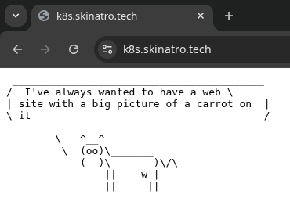
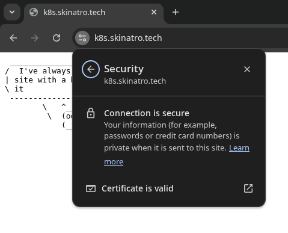
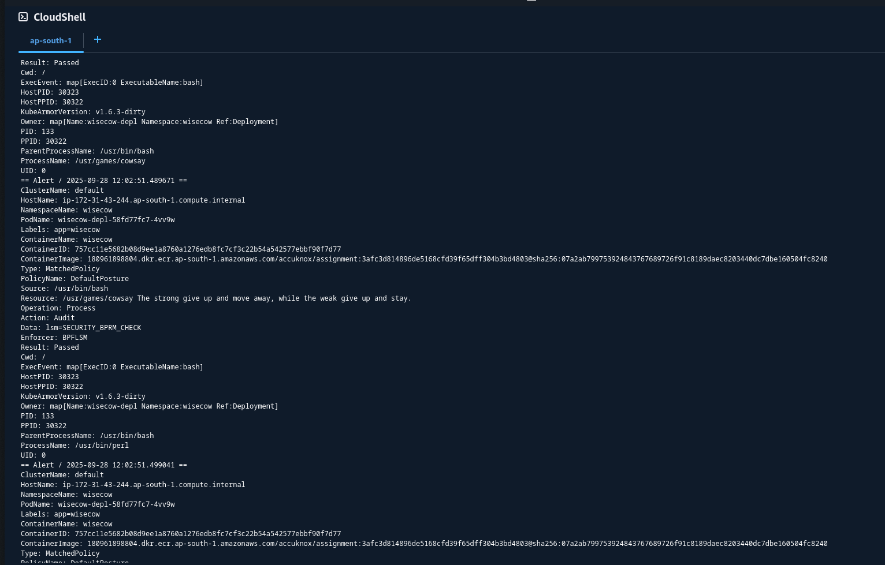
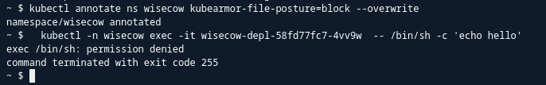

# Problem Statement 1

I am using AWK Stack -> ECR for image registry, EKS, ELB as the ingress controller and ACM for certs

- [X] Dockerization
- [X] Kubernates
- [X] CI/CD
  - [X] CI
  - [X] CD
- [X] TLS

domain -> [k8s.skinatro.tech](http://k8s.skinatro.tech)

## Output

Output works

TLS is enforced

## Improvements

I could have used an alpine image for smaller image size and lesser attack surface but i was not sure if i could use it or not

# Problem Statement 2

I have decided to attempt the Application Health Checker in python and the System Health Monitoring Script in bash

The Solutions are in [./ProblemStatement2](./ProblemStatement2)

# Problem Statement 3

The policy is in [./policies](./policies)

Zero Trust Policy Logs (Audit Mode) 

Zero Trust Block Mode prevents others binaries from being executed